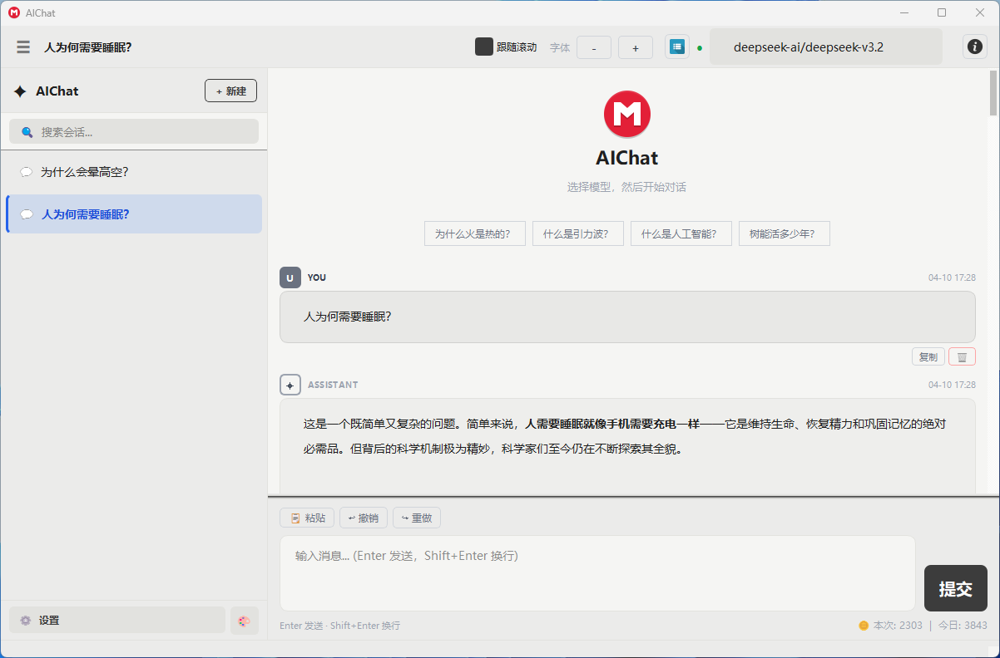
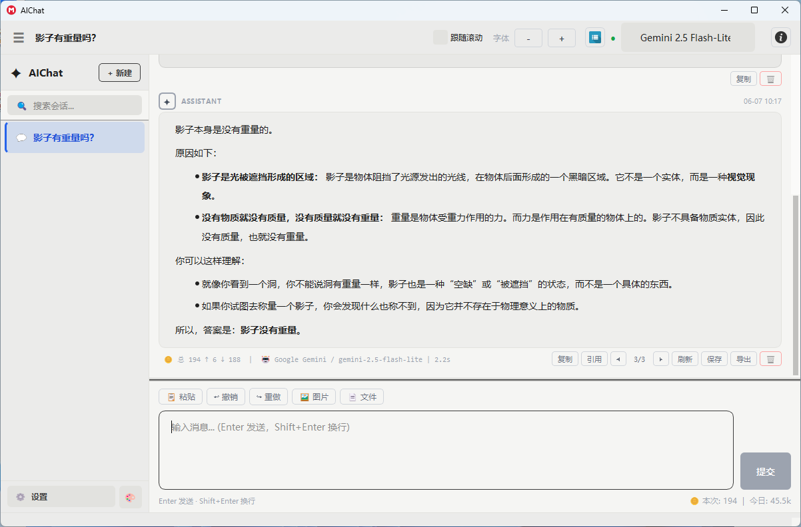

# AIChat 介绍

## 软件定位

AIChat 是一款基于 Qt 开发的桌面 AI 聊天工具，面向希望统一管理多个大模型平台的个人用户与开发者。软件提供本地化的会话管理能力，支持将不同平台、不同模型集中到一个界面中完成配置、切换和对话。

本软件不会过滤用户输入和模型输出内容，可用于模型问答测试。

当前版本：`1.0.0`

## 核心功能

- 多平台管理：支持 OpenAI、Anthropic、Google Gemini、DeepSeek、通义千问、智谱 AI，以及兼容 OpenAI 接口格式的自定义平台。
- 多模型切换：同一平台下可维护多个模型，并在主窗口中快速切换。
- 流式输出：支持 SSE 流式返回，回复内容可以边生成边显示。
- 会话管理：支持新建、删除、重命名、置顶、拖拽排序和历史持久化。
- 推荐问题：支持内置推荐问题，也支持自动生成推荐问题库并按题库刷新展示。
- 导出能力：支持导出聊天记录，也支持将单条回答保存为 Markdown 或导出为 Word。
- 主题与界面：内置多套主题，支持字体缩放、暗色风格和设置页可视化配置。
- 代理支持：支持 HTTP / HTTPS / SOCKS 代理配置。
- 日志记录：程序运行信息、异常信息、网络请求关键状态会写入 `log/` 目录，便于排查问题。

## 主要界面

### 主窗口

主窗口包含会话列表、模型选择区、消息区、输入区和右上角功能菜单。用户可以在这里完成日常对话、历史查看、导出聊天记录和快速切换模型。

### 设置页

设置页包含以下主要模块：

- 平台管理：配置平台地址、API Key、模型列表、系统提示词、代理等内容。
- 主题外观：切换软件主题和界面视觉风格。
- 推荐问题：查看、搜索、导出和自动生成推荐问题库。
- 关于：展示软件版本、主要特性和技术栈说明。

## 数据与目录

软件运行后会在程序目录下生成或使用以下数据目录：

- `config/`：保存平台配置、会话记录、推荐问题库等数据。
- `log/`：保存软件运行日志、错误日志和关键操作日志。
- `resources/`：存放程序使用的图标、图片和资源文件。

## 适用场景

- 在多个 AI 平台之间频繁切换的桌面用户
- 需要长期保存和整理聊天记录的用户
- 需要查看日志、定位接口问题的开发者
- 希望用本地桌面工具统一管理模型配置的个人或团队成员

## 软件特点

- 界面集中，减少在多个网页和客户端之间切换的成本
- 数据本地保存，方便长期管理和备份
- 支持推荐问题库，适合演示、体验和快速发起对话
- 支持详细日志，便于分析接口错误和运行状态
